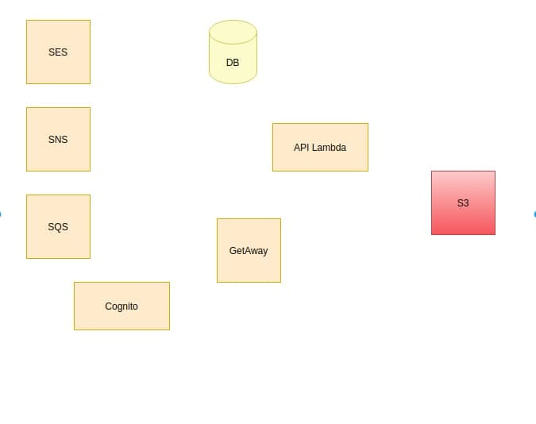

# Deploy

- There are two stack
  - CloudFormation Stack (sls deploy)
  - Lambda Stack (sls deploy -c serverlessFunctions.yml)

#### Deploy all
- In case if you want to deploy all infrastructure just run
```bash
  npm run deploy 
```

#### CloudFormation Stack includes:
  - SES
  - SQS
  - SNS
  - VPC
  - DB (RDS AURORA SERVERLESS postgresql)
  - GetAway
  - S3
  - Cognito

#### Lambda Stack includes: 
  - Cognito Triggers 
  - DB setup (open your aws in browser and run test)
  - Main lambda (./aws/services/core/functions/apollo/index.ts)


  # All AWS structure 
  
  